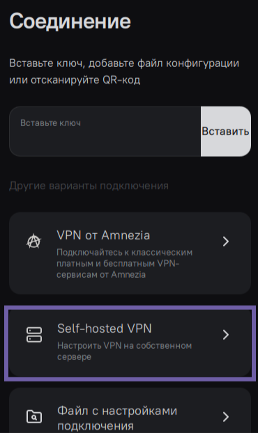
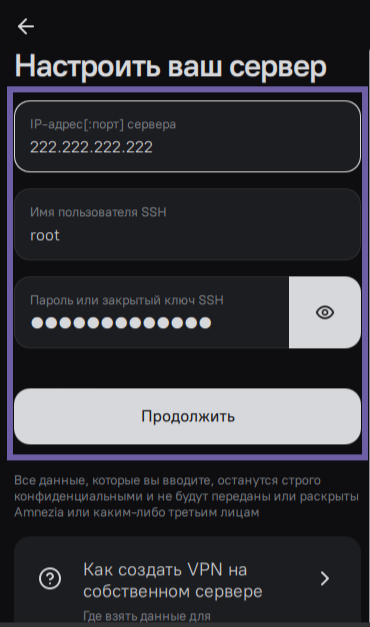
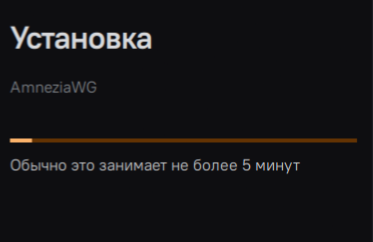
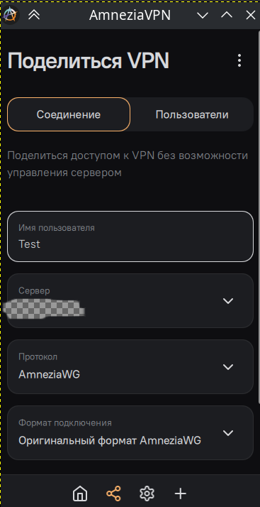

# 🔐 Установка VPN с AmneziaWG на роутер Keenetic


---

## 📋 Содержание

1. [Введение](#-введение)
2. [Требования](#-требования)
3. [Установка VPN на свой сервер](#-установка-vpn-на-свой-сервер)
4. [Подготовка роутера и установка AmnezaWG на роутер Keenetic](#-подготовка-роутера-и-установка-amnezawg-на-роутер-keenetic)
5. [Получение конфигурации](#-получение-конфигурации)
6. [Импорт и настройка WireGuard](#-импорт-и-настройка-wireguard)
7. [Настройка параметров ASC](#-настройка-параметров-asc)
8. [Настройка DNS](#-настройка-dns)
9. [Настройка политик доступа](#-настройка-политик-доступа)
10. [Проверка работы](#-проверка-работы)
11. [Решение проблем](#-решение-проблем)
12. [Дополнительные ресурсы](#-дополнительные-ресурсы)
13. [Советы для новичков](#-cоветы-для-новичков)
14. [Сравнение протоколов](#-сравнение-протоколов)
15. [Заключение](#-заключение)
16. [Поддержка](#-поддержка)
---

## 🎯 Введение

**AmneziaWG** — это модифицированная версия протокола WireGuard, которая добавляет дополнительные параметры обфускации (ASC-параметры) для защиты от обнаружения VPN-трафика провайдером.

### Что такое ASC-параметры?

ASC (Advanced Stealth Capabilities) — это набор параметров, которые маскируют WireGuard-трафик:
- **Jc, Jmin, Jmax** — параметры "мусорных" пакетов
- **S1, S2** — размеры пакетов
- **H1, H2, H3, H4** — "магические" заголовки

---

## ✅ Требования

### Обязательные требования

- **Роутер Keenetic** с поддержкой KeeneticOS 4.2+
- **Файл конфигурации AmneziaWG** в формате `.conf`
- **Доступ к веб-интерфейсу** роутера
- **Базовые знания** работы с роутером

### 📝 Что нужно подготовить:
- VPS-провайдер: Снять в аренду сервер у провайдера
- IP-адрес вашего сервера
- Логин вашего сервера: `root` как пример
- SSH-доступ к серверу или пароль выданный хостинг провайдером

```diff
-⚠️ Серверы на Reg.ru и Yandex Cloud не подходят для установки VPN с помощью Amnezia!
```

### 🖥️ Системные требования к вашему серверу:
- **ОС**: Linux, подходит Ubuntu 22.04 или Debian 11
- **RAM**: рекомендуемая 2 Гб, но не меньше 1 Гб
- **Диск**: минимум 2 ГБ свободного места
- **Root-доступ** или пользователь с sudo правами

### Обновление системы (Эту команду нужно выполнить на вашем сервере)👇

```bash
# Обновляем пакеты системы
sudo apt update && sudo apt upgrade -y
```
---

## 📦  Установка VPN на свой сервер

- [Скачайте приложение AmneziaVPN на ваш телефон или компьютер и внесите данные сервера](https://amnezia.org/ru/downloads)

- [Ссылка на зеркало у кого сайт не доступен](https://storage.googleapis.com/amnezia/amnezia.org) 👈

- 👇Открываем установленное приложение👇 ( 📷 скриншот ниже) и жмём **Self-hosted VPN**



- Далее добавьте данные для подключения. Внесите IP логин и пароль от VPS - сервера, нажмите **Продолжить**.

### 📷 Скриншот ниже 👇



- Если вы меняли port, укажите его через двоеточие после IP.
- Если в ваших данных подключения нет логина, впишите root.
- Вместо пароля, вы можете использовать SSH-ключ.
- Вместо IP-адреса вы можете внести доменное имя.
- 👇Ждем установку на ваш сервер👇.



```diff
-⚠️ **Важно:** Каждый файл конфигурации можно использовать только на одном устройстве!
```

### Нажмите на кнопку 👇**Подключиться**👇.


### 🎉 Теперь вы можете делиться подключением с другими людьми, добавлять и удалять протоколы, выбрать сайты-исключения, установить собственный DNS и еще многое другое

---

## 🔧 Подготовка роутера и установка AmnezaWG на роутер Keenetic

### Шаг 1: Вход в веб-интерфейс

Откройте в браузере один из адресов:

```
http://192.168.1.1
http://192.168.0.1
http://my.keenetic.net
```

**Логин по умолчанию:** `admin`  
**Пароль:** указан на обратной стороне роутера или `admin`/`1234`

- 📷 Смотри скриншот ниже 👀 должен открыться следующий интерфейс 👇


### Шаг 2: Резервная копия настроек


1. Перейдите: **Управление** → **Параметры системы**
2. Разверните пункт **startup-config**
3. Сохраните резервную копию текущих настроек

> 💡 Это защитит вас от потери настроек в случае ошибки!

### Шаг 3: Проверка версии KeeneticOS

Убедитесь, что установлена версия **4.2 или выше**:

1. Перейдите: **Управление** → **Параметры системы**
2. Проверьте текущую версию
3. Если версия ниже 4.2, обновите систему

> 📌 **Совет:** Если обновление недоступно, переключите канал на **"Предварительный"**

### Шаг 4: Установка компонента WireGuard VPN

1. Нажмите **"Изменить набор компонентов"**
2. В секции **"Сетевые функции"** найдите **"WireGuard VPN"**
3. Если не установлен — отметьте чекбокс
4. Нажмите **"Обновить KeeneticOS"**
5. Дождитесь завершения и перезагрузки роутера


### Шаг 5: Обновление системы

После установки компонента:

1. Вернитесь в **"Параметры системы"**
2. Нажмите **"Обновить KeeneticOS"**
3. Дождитесь перезагрузки

> ⚠️ Если появляется ошибка "Недостаточно места" — отключите ненужные компоненты

---

## 📁 Получение конфигурации

### Откуда взять конфигурацию для вашего роутера после установки приложения?

- Нужно настроить **VPN** на собственном роутере для этого нужно получить конфигурацию из приложения **AmneziaVPN**
- теперь вам потребуется файл конфигурации AmneziaWG в нативном формате (т.е. файл с расширением .conf).

```diff
-⚠️ **Важно:** Каждый файл конфигурации можно использовать только на одном устройстве!
```

### Вариант 1: Self-hosted VPN

1. Откройте приложение **AmneziaVPN** 
2. Перейдите в **"Поделиться VPN"** (вторая иконка в нижней панели)
3. Выберите формат: **"Оригинальный формат AmneziaWG"**
4. Нажмите **"Поделиться"** 

   📷 смотри скриншот 👀 ниже 👇

   

5. На следующем экране нажмите **"Поделиться"** сверху
6. Сохраните файл и запомните место сохранения

### Шаг 6: Открытие конфигурации

Откройте сохранённый `.conf` файл в текстовом редакторе (Блокнот, Notepad++).

Вам понадобятся следующие параметры:

```ini
[Interface]
PrivateKey = ...
Address = ...
DNS = ...

# ASC-параметры (в конце файла)
Jc = 8
Jmin = 50
Jmax = 1000
S1 = 30
S2 = 32
H1 = 1811016522
H2 = 1196729875
H3 = 457766807
H4 = 1765857463

[Peer]
PublicKey = ...
PresharedKey = ...
Endpoint = ...
AllowedIPs = ...
```

> 📝 **Запишите значения** Jc, Jmin, Jmax, S1, S2, H1, H2, H3, H4 — они понадобятся позже!

---

## 🌐 Импорт и настройка WireGuard

### Шаг 7: Импорт конфигурации в вэб морде роутера

1. Перейдите: **Интернет** → **Другие подключения**
2. Выберите секцию **WireGuard**
3. Нажмите **"Загрузить из файла"**
4. Выберите сохранённый `.conf` файл
5. Нажмите **"Открыть"**

Через несколько секунд появится новое подключение.

### Шаг 8: Настройка подключения

1. Кликните по строке созданного подключения (не на переключатель!)
2. Отметьте чекбокс: **"Использовать для выхода в интернет"**
3. Нажмите **"Сохранить"** внизу страницы

> ⚠️ **Важно:** Внутренний IP-адрес должен быть уникальным среди других WireGuard-подключений!

---

## ⚙️ Настройка параметров ASC

### Шаг 9: Открытие командной строки

1. Нажмите на **шестерёнку** в правом верхнем углу роутера
2. Выберите **"Командная строка"**

---

### Шаг 10: Определение имени интерфейса

В командной строке введите:

```bash
show interface
```

Нажмите **"Отправить запрос"**

### Шаг 11: Поиск вашего интерфейса

1. Нажмите `Ctrl + F` для поиска
2. Введите название вашего подключения (например, `amnezia_for_awg`)
3. Найдите поле `description` с этим названием
4. Рядом будет поле `interface-name` (например, `Wireguard0`)

> 📌 **Запомните:** `interface-name` — это имя вашего интерфейса!

### Шаг 12: Применение ASC-параметров

Теперь, зная имя интерфейса и значения параметров asc из файла в формате .conf который сохранили ранее. Нужно заменить все значения шаблона в скобках, вашими значениями, а сами скобки удалить.

Составьте команду по шаблону:

```bash
interface {interface-name} wireguard asc {jc} {jmin} {jmax} {s1} {s2} {h1} {h2} {h3} {h4}
```

**Пример с реальными значениями:**

```bash
interface Wireguard0 wireguard asc 8 50 1000 30 32 1811016522 1196729875 457766807 1765857463
```

Получившуюся строку, нужно вставить в вэб-версии командной строки роутера, и нажать кнопку **Отправить запрос**.

### Шаг 13: Сохранение конфигурации

Введите команду:

```bash
system configuration save
```

Нажмите **Отправить запрос**

> ✅ Если всё правильно, появится подтверждение успешного выполнения.

> ✅ Теперь нужно перейти в раздел "Интернет", далее "Другие подключения", и проверить работоспособность созданного подключения WireGuard, переключив его состояние на "Включено". Через несколько секунд, отметка активности пира, должна изменить цвет с серого, на зелёный. Также, должна отобразиться информация о входящем/исходящем трафике, и о времени с последнего "рукопожатия".

---

## 🌍 Настройка DNS

### Шаг 14: Включение DNS-over-TLS и DNS-over-HTTPS

1. Перейдите: **Управление** → **Параметры системы** → **Общие настройки системы**
2. Жмём кнопку изменить набор компонентов
3. Найдите и отметьте:
   - ✅ **Прокси-сервер DNS-over-TLS**
   - ✅ **Прокси-сервер DNS-over-HTTPS**
   - ✅ **Жмём кнопку обновить KeeneticOS** роутер будет перезагружен (ждем)

### Шаг 15: Игнорирование DNS провайдера

1. Перейдите: **Интернет** → **Кабель "Ethernet"**
2. В разделе **"Порты и VLANы"** отметьте:
   - ✅ **Игнорировать DNSv4 интернет-провайдера**
3. Нажмите **"Сохранить"**

### Шаг 16: Добавление DNS-серверов

1. Перейдите: **Интернет-фильтры** → **Настройка DNS**
2. Нажмите **"Добавить сервер"**
3. Добавьте рекомендуемые DNS:

| DNS | Адрес |
|-----|-------|
| **Cloudflare** | `1.1.1.1` |
| **Google** | `8.8.8.8` |
| **Quad9** | `9.9.9.9` |

---

## 🎯 Настройка политик доступа

### Шаг 17: Настройка политики по умолчанию

1. Перейдите: **Интернет** → **Приоритеты подключений**
2. В **"Политике по умолчанию"** VPN-подключение (например, `amnezia_for_awg`) должно идти **ниже** основного интернет-подключения

> 💡 Это предотвратит проблемы при обрыве основного соединения

### Шаг 18: Создание новой политики VPN

1. Нажмите **"+ Добавить политику"**
2. Введите имя: **VPN**
3. Нажмите **"Сохранить"** (зелёная галочка)

> ⚠️ **Не включайте** "Многопутевой режим"!

### Шаг 19: Настройка политики VPN

1. Для политики **VPN** отметьте чекбокс только на вашем AmneziaWG-подключении
2. Нажмите **"Сохранить"** внизу страницы

### Важные моменты:

| Вариант | Описание | Плюсы | Минусы |
|---------|----------|-------|--------|
| **Только VPN** | В политике только AmneziaWG | Нет утечек трафика | При отключении VPN нет интернета |
| **VPN + Ethernet** | Резервное подключение | Всегда есть интернет | Возможны утечки трафика |

### Шаг 20: Назначение устройств в политику VPN

1. Перейдите на вкладку **"Применение политик"**
2. В списке слева выберите **"Политика по умолчанию"**
3. В выпадающем меню сверху выберите **"VPN"**
4. Отметьте устройства, которые должны использовать VPN
5. Нажмите **"Подтвердить"**

> 💡 **Совет:** Устройства можно перетаскивать между политиками

### Шаг 21: Настройка гостевой сети (опционально)

Если хотите раздавать отдельную Wi-Fi сеть с VPN:

1. Найдите сегмент **"Гостевая сеть"**
2. Переместите его в политику **VPN**
3. Настройте гостевую Wi-Fi сеть

Результат: две Wi-Fi сети — обычная и с VPN!

---

## ✅ Проверка работы

### Шаг 22: Включение VPN

1. Перейдите: **Интернет** → **Другие подключения**
2. Найдите ваше WireGuard-подключение
3. Переключите его в состояние **"Включено"**

Через несколько секунд:
- ✅ Индикатор активности пира станет **зелёным**
- ✅ Отобразится информация о трафике
- ✅ Появится время последнего "рукопожатия"

### Шаг 23: Проверка IP-адреса

На устройствах, добавленных в политику VPN, откройте:

```
https://myip.ru/
```

Вы должны увидеть IP-адрес вашего VPN-сервера, а не провайдера!

### Шаг 24: Выход из настроек

1. Нажмите на **шестерёнку** в правом верхнем углу
2. Нажмите **"Выйти"** в правом нижнем углу

---

## 🔧 Решение проблем

### Проблема: Подключение не устанавливается

**Возможные причины:**

1. **Неправильные ASC-параметры**
   - Проверьте значения Jc, Jmin, Jmax, S1, S2, H1-H4
   - Убедитесь, что нет лишних пробелов в команде

2. **Конфликт IP-адресов**
   - Проверьте, что внутренний IP уникален
   - Создайте новую конфигурацию с другим IP

3. **Блокировка портов**
   - Убедитесь, что порт VPN-сервера открыт
   - Проверьте настройки файрвола

### Проблема: Нет интернета через VPN

**Решение:**

1. Проверьте DNS-настройки (Шаг 14-16)
2. Убедитесь, что отмечено "Использовать для выхода в интернет"
3. Проверьте политику доступа устройства
4. Перезагрузите роутер

### Проблема: Утечки DNS

**Решение:**

1. Проверьте DNS на сайте: `https://dnsleaktest.com`
2. Убедитесь, что включены DNS-over-TLS и DNS-over-HTTPS
3. Проверьте, что отмечено "Игнорировать DNS провайдера"

### Проблема: Медленная скорость

**Возможные причины:**

1. **Перегрузка VPN-сервера** — попробуйте другой сервер
2. **Маршрутизация** — проверьте AllowedIPs в конфигурации
3. **Производительность роутера** — некоторые модели имеют ограничения

### Просмотр логов

Для диагностики проблем:

1. Перейдите: **Управление** → **Диагностика**
2. Выберите **"Показать журнал"**
3. Ищите ошибки, связанные с WireGuard

---

## 📚 Дополнительные ресурсы

### Официальная документация

- [Документация Amnezia](https://docs.amnezia.org)
- [Форум Keenetic](https://forum.keenetic.ru)
- [Документация WireGuard](https://www.wireguard.com)

### Полезные команды KeeneticOS

```bash
# Просмотр всех интерфейсов
show interface

# Просмотр конфигурации WireGuard
show wireguard

# Сохранение конфигурации
system configuration save

# Перезагрузка роутера
system reboot

# Просмотр маршрутов
show ip route
```

---

## 🎓 Советы для новичков

### 1. Безопасность

- ✅ Всегда создавайте резервную копию перед изменениями
- ✅ Используйте сложные пароли для роутера
- ✅ Регулярно обновляйте KeeneticOS
- ✅ Не делитесь конфигурационными файлами

### 2. Производительность

- 🔥 AmneziaWG быстрее OpenVPN, но медленнее обычного WireGuard
- 🔥 Используйте VPN только для нужных устройств
- 🔥 Рассмотрите настройку раздельного туннелирования

### 3. Конфиденциальность

- 🔒 Используйте DNS-over-HTTPS/TLS
- 🔒 Проверяйте отсутствие утечек DNS
- 🔒 Избегайте бесплатных VPN-серверов

---

## 📊 Сравнение протоколов

| Параметр | WireGuard | AmneziaWG | OpenVPN |
|----------|-----------|-----------|---------|
| **Скорость** | ⭐⭐⭐⭐⭐ | ⭐⭐⭐⭐ | ⭐⭐⭐ |
| **Безопасность** | ⭐⭐⭐⭐⭐ | ⭐⭐⭐⭐⭐ | ⭐⭐⭐⭐ |
| **Обход блокировок** | ⭐⭐ | ⭐⭐⭐⭐⭐ | ⭐⭐⭐⭐ |
| **Простота настройки** | ⭐⭐⭐⭐⭐ | ⭐⭐⭐ | ⭐⭐ |
| **Поддержка роутерами** | ⭐⭐⭐⭐ | ⭐⭐⭐ | ⭐⭐⭐⭐⭐ |

---

## ✨ Заключение

Теперь у вас настроен VPN с AmneziaWG на роутере Keenetic! Основные преимущества:

- 🚀 Высокая скорость соединения
- 🛡️ Защита от обнаружения провайдером
- 🌐 Все устройства защищены автоматически
- ⚡ Современный и безопасный протокол

---

## 💬 Поддержка

Если у вас возникли вопросы:

1. **Форум Keenetic:** https://forum.keenetic.ru
2. **Чат Amnezia:** Через официальный сайт
3. **Документация:** https://docs.amnezia.org

---


**Успешной настройки! 🎉**