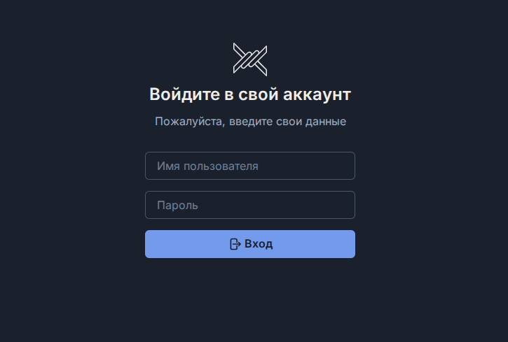
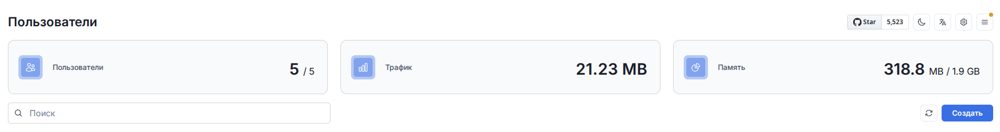
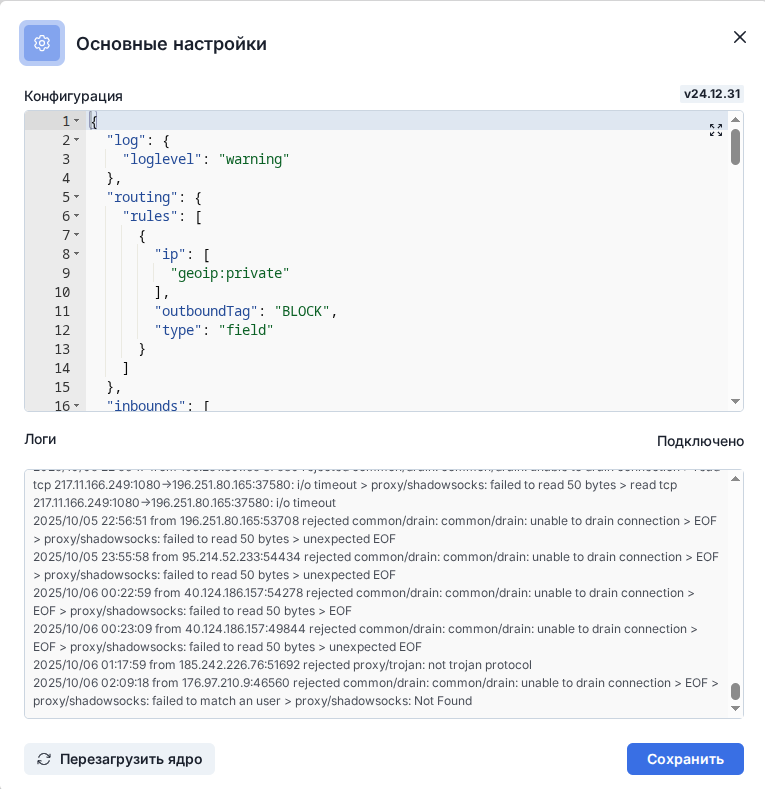
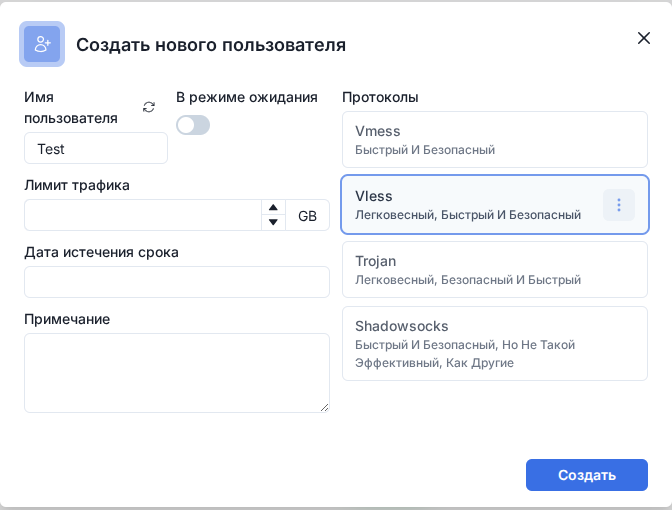
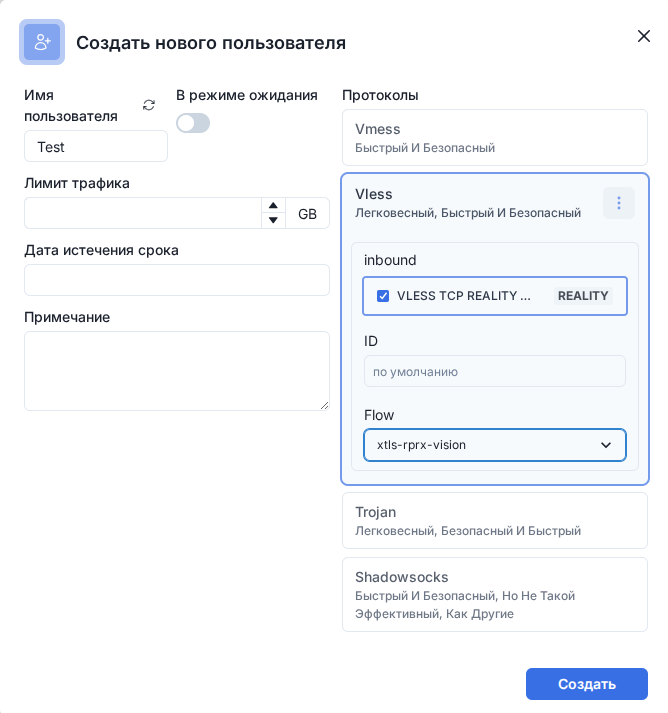

# 🚀 Полная инструкция по установке прокси панели Marzban без домена с доступом через SSH-туннель


---

# 🎯 О проекте Marzban
Marzban - это мощный инструмент управления прокси-серверами с современным веб-интерфейсом, работающий на базе Xray-core.

- ✨ Основные возможности:
- 🌐 Встроенный веб-интерфейс
- 🔄 Поддержка протоколов: Vmess, VLESS, Trojan, Shadowsocks
- 👥 Управление множеством пользователей
- 📊 Мониторинг трафика и статистики
- 🤖 Интеграция с Telegram Bot
- 🔗 Автоматическая генерация ссылок подписок
- 🛡️ Поддержка TLS и REALITY

## Содержание

1. [Критические ограничения](#-критические-ограничения)
2. [Предварительная подготовка](#-предварительная-подготовка)
3. [Предварительные требования](#-предварительные-требования)
4. [Подготовка системы](#-подготовка-системы)
5. [Установка Marzban](#-установка-marzban)
6. [Обновление Marzban](#-обновление-marzban)
7. [Настройка без SSL и доменного имени](#-настройка-без-ssl-и-доменного-имени)
8. [Создание администратора](#-создание-администратора)
9. [Подключение через SSH туннель](#-подключение-через-ssh-туннель)
10. [Настройка подключений](#-настройка-подключений)
11. [Ручное создание конфигураций](#-ручное-создание-конфигураций)
12. [Клиенты для подключения к прокси панели marzban](#-клиенты-для-подключения-к-прокси-панели-marzban)
13. [Полезные команды](#-полезные-команды)
14. [Устранение проблем](#-устранение-проблем)
15. [Поддержка и сообщество](#-поддержка-и-сообщество)
16. [Заключение](#-заключение)


---

## 🚨 Критические ограничения

> **⚠️ ВНИМАНИЕ:** Прочитайте это перед началом установки!

```diff
- Автоматические ссылки подписок НЕ РАБОТАЮТ
- Конфигурации придется выдавать ВРУЧНУЮ
- Панель доступна ТОЛЬКО через SSH-туннель
- Рекомендуется ТОЛЬКО для тестирования (не для продакшин)
```

### Что НЕ будет работать:
- ❌ Автоматическое обновление конфигураций через подписки
- ❌ Удобные QR-коды для быстрого подключения
- ❌ Массовая рассылка конфигураций пользователям
- ❌ Доступ к панели без активного SSH-соединения

### Что БУДЕТ работать:
- ✅ Панель управления через SSH-туннель
- ✅ Создание пользователей и управление ими
- ✅ Все протоколы (VLESS, Trojan, VMess, Shadowsocks)
- ✅ Ручная выдача конфигураций клиентам
- ✅ Мониторинг трафика и статистики

### 💡 Рекомендация

Если вам нужна **полноценная работа** с автоматическими подписками:
- Используйте вариант [**с доменом и SSL-сертификатом**](https://github.com/DataSithAi/Proxy/blob/main/marzban_ssl_guide.md)
- Бесплатный домен (DuckDNS) + самоподписанный SSL
- Это займет столько же времени, но даст все возможности

---

## ✅ Предварительная подготовка

### Чеклист перед началом:

- [ ] Чистая установка Ubuntu/Debian на сервере
- [ ] Root-доступ или sudo права
- [ ] SSH-доступ к серверу (проверен)
- [ ] SSH-клиент на локальном компьютере
- [ ] IP-адрес сервера записан
- [ ] Минимум 30-40 минут свободного времени
- [ ] Понимание, что подписки работать не будут

---

## ⚙️ Предварительные требования

### 🖥️ Системные требования:

| Компонент | Минимум | Рекомендуется |
|-----------|---------|---------------|
| **CPU** | 1 ядро | 2 ядра |
| **RAM** | 512 MB | 1 GB+ |
| **Диск** | 2 GB | 5 GB+ |
| **ОС** | Ubuntu 18.04+ | Ubuntu 22.04 |
| **Сеть** | 1 Мбит/с | 10+ Мбит/с |

### 🌐 Сетевые требования:

- **Открытые порты**: 80, 443, 8000
- **Стабильное интернет-соединение**

### 📝 Что нужно подготовить:
- IP-адрес вашего сервера
- SSH-доступ к серверу

---

## 🛠️ Подготовка системы

### Шаг 1: Обновление системы

```bash
# Подключитесь к серверу
ssh root@IP_СЕРВЕРА

# Обновите систему
sudo apt update && sudo apt upgrade -y

# Установите необходимые пакеты
sudo apt install curl wget git nano -y
```

**Что делают эти команды:**
- `apt update` - обновляет информацию о доступных пакетах
- `apt upgrade -y` - обновляет все установленные пакеты (флаг -y автоматически подтверждает)
- `apt install` - устанавливает утилиты для работы

---

## 📦 Установка Marzban

### Шаг 2: Автоматическая установка

```bash
# Установка Marzban с базой данных SQLite (рекомендуется)
sudo bash -c "$(curl -sL https://github.com/Gozargah/Marzban-scripts/raw/master/marzban.sh)" @ install
```

> 💡 **Альтернативные варианты:**
> ```bash
> # С MySQL
> sudo bash -c "$(curl -sL https://github.com/Gozargah/Marzban-scripts/raw/master/marzban.sh)" @ install --database mysql
>```

>```bash
> # С MariaDB  
> sudo bash -c "$(curl -sL https://github.com/Gozargah/Marzban-scripts/raw/master/marzban.sh)" @ install --database mariadb
> ```

### 🔄 Обновление Marzban

```bash
# Обновление до последней версии
sudo bash -c "$(curl -sL https://github.com/Gozargah/Marzban-scripts/raw/master/marzban.sh)" @ update
```

**Что происходит:**
- Скачивается официальный скрипт установки
- Устанавливается Docker и Docker Compose
- Создаются необходимые директории
- Устанавливается Marzban в Docker контейнере
- Запускается служба автоматически

### Включаем автозапуск Marzban при загрузке системы
```bash
sudo systemctl enable docker
```

### Шаг 3: Остановка после установки

```bash
# Останавливаем Marzban для настройки
marzban down
```
**Результат:**
```
[+] Running 1/1
 ✔ Container marzban-marzban-1  Removed
```

---

## ⚙️ Настройка без SSL и доменного имени

### Шаг 4: Редактирование конфигурации

```bash
# Открываем конфигурационный файл
sudo nano /opt/marzban/.env
```

### Шаг 5: Настройка порта и пути к панели. Базовая конфигурация без SSL

Конфигурационный файл Marzban (.env) с подробными комментариями

📘 Введение
Этот файл содержит все возможные настройки для панели Marzban. Большинство параметров закомментированы (начинаются с #) и используются значения по умолчанию. Раскомментируйте только те строки, которые вам нужно изменить.

Замените содержимое на следующее (с вашими изменениями):

```env
# ========================================
# 🌐 ОСНОВНЫЕ НАСТРОЙКИ MARZBAN БЕЗ SSL
# ========================================

# Хост, на котором запускается панель.
# "127.0.0.1" означает, что доступ будет только с этого сервера (более безопасно).
# Если хотите открыть доступ извне — используйте "0.0.0.0".
UVICORN_HOST="127.0.0.1"

# Порт, на котором будет доступна панель управления.
# Можно выбрать любой свободный (например: 8080, 9000, 7777, 3000).
UVICORN_PORT=8080

# Пример, если хотите открыть панель для доступа из интернета:
# UVICORN_HOST = "0.0.0.0"   ← панель будет доступна всем
# UVICORN_PORT = 8000        ← работает на порту 8000
# ALLOWED_ORIGINS=http://localhost,http://localhost:8000,http://example.com  ← список сайтов, откуда разрешены запросы

# ❗ Администратора лучше создавать через команду:
# marzban cli superuser create
# Эти строки использовать нежелательно (менее безопасно).
# SUDO_USERNAME = "admin"   ← логин администратора
# SUDO_PASSWORD = "admin"   ← пароль администратора


# ========================================
# 🔒 SSL НАСТРОЙКИ (НЕ ИСПОЛЬЗУЮТСЯ!)
# ========================================
# Эти строки нужны только если у вас есть SSL-сертификаты (например от Let’s Encrypt).
# Если SSL нет — ничего не трогаем.
# UVICORN_UDS: "/run/marzban.socket"
# UVICORN_SSL_CERTFILE = "/var/lib/marzban/certs/example.com/fullchain.pem"  ← файл сертификата
# UVICORN_SSL_KEYFILE = "/var/lib/marzban/certs/example.com/key.pem"        ← приватный ключ
# UVICORN_SSL_CA_TYPE = "public"                                           ← тип сертификата


# ========================================
# 🌍 URL НАСТРОЙКИ
# ========================================
# Адрес панели, который используется системой (для внутренней логики).
# Работает даже если доступ только локальный.
SUB_BASE_URL=http://127.0.0.1:8080


# ========================================
# 🎛 ПУТЬ К ПАНЕЛИ УПРАВЛЕНИЯ
# ========================================
# URL-адрес для входа в админку.  
# Лучше сделать уникальный путь, чтобы скрыть панель от посторонних.
# Примеры: /my-admin/, /control-2024/, /secret-panel/
DASHBOARD_PATH="/my-admin-panel/"

# Если ничего не менять — стандартный путь будет такой:
# DASHBOARD_PATH = "/dashboard/"


# ========================================
# 📁 НАСТРОЙКИ XRAY
# ========================================
# Путь к файлу конфигурации XRAY (основной VPN движок).
XRAY_JSON = "/var/lib/marzban/xray_config.json"

# Дополнительные (чаще всего не нужны):
# XRAY_SUBSCRIPTION_URL_PREFIX = "https://example.com"   ← ссылка на подписку
# XRAY_SUBSCRIPTION_PATH = "sub"                        ← путь подписки
# XRAY_EXECUTABLE_PATH = "/usr/local/bin/xray"          ← путь к исполняемому файлу XRAY
# XRAY_ASSETS_PATH = "/usr/local/share/xray"            ← ресурсы XRAY
# XRAY_EXCLUDE_INBOUND_TAGS = "INBOUND_X INBOUND_Y"     ← исключения
# XRAY_FALLBACKS_INBOUND_TAG = "INBOUND_X"              ← fallback настройки


# ========================================
# 🤖 ИНТЕГРАЦИЯ С TELEGRAM / DISCORD (опционально)
# ========================================
# Эти параметры нужны, если хотите управлять панелью через Telegram или Discord.
# TELEGRAM_API_TOKEN = 123456789:AAAAAAAAAAAAAAAAAAAAAAAAAAAAAAAAAAA  ← токен бота
# TELEGRAM_ADMIN_ID = 987654321, 123456789                             ← ID админов
# TELEGRAM_LOGGER_CHANNEL_ID = -1234567890123                          ← канал для логов
# TELEGRAM_DEFAULT_VLESS_FLOW = "xtls-rprx-vision"                     ← тип соединения
# TELEGRAM_PROXY_URL = "http://localhost:8080"                         ← прокси

# DISCORD_WEBHOOK_URL = "https://discord.com/api/webhooks/xxxxxxx"     ← интеграция с Discord


# ========================================
# 🎨 КАСТОМНЫЕ ШАБЛОНЫ (опционально)
# ========================================
# Здесь можно подключать свои шаблоны страниц и конфигов.
# CUSTOM_TEMPLATES_DIRECTORY="/var/lib/marzban/templates/"
# CLASH_SUBSCRIPTION_TEMPLATE="clash/my-custom-template.yml"
# SUBSCRIPTION_PAGE_TEMPLATE="subscription/index.html"
# HOME_PAGE_TEMPLATE="home/index.html"

# V2RAY_SUBSCRIPTION_TEMPLATE="v2ray/default.json"
# V2RAY_SETTINGS_TEMPLATE="v2ray/settings.json"

# SINGBOX_SUBSCRIPTION_TEMPLATE="singbox/default.json"
# SINGBOX_SETTINGS_TEMPLATE="singbox/settings.json"

# MUX_TEMPLATE="mux/default.json"

# USE_CUSTOM_JSON_DEFAULT=True   ← включить использование JSON-конфига по умолчанию
# USE_CUSTOM_JSON_FOR_V2RAYN=False  ← включить только для конкретных клиентов
# USE_CUSTOM_JSON_FOR_V2RAYNG=True


# ========================================
# 🗄️ БАЗА ДАННЫХ
# ========================================
# Здесь хранится база пользователей и вся информация.
# По умолчанию SQLite (файл базы находится на сервере).
SQLALCHEMY_DATABASE_URL = "sqlite:////var/lib/marzban/db.sqlite3"

# Для больших проектов можно настраивать пул подключений:
# SQLALCHEMY_POOL_SIZE = 10
# SQLIALCHEMY_MAX_OVERFLOW = 30


# ========================================
# ⚙️ ДОПОЛНИТЕЛЬНЫЕ НАСТРОЙКИ
# ========================================

# Тексты для статусов (как будут отображаться пользователям).
# ACTIVE_STATUS_TEXT = "Active"     ← активен
# EXPIRED_STATUS_TEXT = "Expired"   ← срок истёк
# LIMITED_STATUS_TEXT = "Limited"   ← ограничен
# DISABLED_STATUS_TEXT = "Disabled" ← выключен
# ONHOLD_STATUS_TEXT = "On-Hold"    ← заморожен

# Автоматическое удаление пользователей (по умолчанию выключено).
# USERS_AUTODELETE_DAYS = -1   ← отрицательное значение = автоудаление отключено
# USER_AUTODELETE_INCLUDE_LIMITED_ACCOUNTS = false ← удалять ли ограниченные аккаунты

# Уведомления (True = включено, False = выключено).
# NOTIFY_STATUS_CHANGE = True          ← уведомлять при смене статуса
# NOTIFY_USER_CREATED = True           ← при создании пользователя
# NOTIFY_USER_UPDATED = True           ← при изменении
# NOTIFY_USER_DELETED = True           ← при удалении
# NOTIFY_USER_DATA_USED_RESET = True   ← при сбросе трафика
# NOTIFY_USER_SUB_REVOKED = True       ← при отзыве подписки
# NOTIFY_IF_DATA_USAGE_PERCENT_REACHED = True ← при достижении лимита трафика
# NOTIFY_IF_DAYS_LEFT_REACHED = True   ← при приближении окончания подписки
# NOTIFY_LOGIN = True                  ← уведомлять о входе

# Белый список IP-адресов, для которых отключаются уведомления о входе.
# LOGIN_NOTIFY_WHITE_LIST = '1.1.1.1,127.0.0.1'

# Для разработчиков (отладка и документация).
# DOCS=True
# DEBUG=True

# Вебхуки — возможность отправлять события на другие сервера.
# WEBHOOK_ADDRESS = "http://127.0.0.1:9000/,http://127.0.0.1:9001/"
# WEBHOOK_SECRET = "something-very-very-secret"
# NOTIFY_DAYS_LEFT=3,7               ← за сколько дней предупреждать
# NOTIFY_REACHED_USAGE_PERCENT=80,90 ← при каком % трафика уведомлять

# API и токены
# VITE_BASE_API="https://example.com/api/"    ← базовый API-адрес
# JWT_ACCESS_TOKEN_EXPIRE_MINUTES = 1440      ← время жизни токена (минуты)

# Системные задачи (в секундах).
# JOB_CORE_HEALTH_CHECK_INTERVAL = 10        ← проверка здоровья системы
# JOB_RECORD_NODE_USAGES_INTERVAL = 30       ← запись нагрузки по нодам
# JOB_RECORD_USER_USAGES_INTERVAL = 10       ← запись использования по пользователям
# JOB_REVIEW_USERS_INTERVAL = 10             ← проверка пользователей
# JOB_SEND_NOTIFICATIONS_INTERVAL = 30       ← рассылка уведомлений
```

#### Примеры безопасных настроек:

**Вариант 1 (рекомендуемый):**
```env
UVICORN_PORT=8080
SUB_BASE_URL=http://127.0.0.1:8080
DASHBOARD_PATH="/secret-admin-2024/"
```

**Вариант 2:**
```env
UVICORN_PORT=9000
SUB_BASE_URL=http://127.0.0.1:9000
DASHBOARD_PATH="/control-xyz/"
```

**Вариант 3:**
```env
UVICORN_PORT=7777
SUB_BASE_URL=http://127.0.0.1:7777
DASHBOARD_PATH="/my-lenovo-panel/"
```

#### Важные правила:

- **UVICORN_PORT** - выберите порт от 1024 до 65535
- **SUB_BASE_URL** - порт должен совпадать с UVICORN_PORT
- **DASHBOARD_PATH** - обязательно начинать и заканчивать слешем `/`
- Используйте сложные пути для дополнительной безопасности

**Сохранение:**
- Нажмите `Ctrl+S`
- Нажмите `Ctrl+X`

---

## 👤 Создание администратора

### Шаг 6: Запуск Marzban

```bash
# Запускаем Marzban
marzban up --no-logs
```

### Шаг 7: Создание администратора

```bash
# Создаем администратора
marzban cli admin create --sudo
```

**Интерактивный ввод:**
```
Username: admin
Password: ********
Repeat Password: ********
✔ Admin created successfully
```

**Рекомендации по паролю:**
- Минимум 12 символов
- Используйте буквы, цифры и спецсимволы
- Не используйте словарные слова
- Пароль должен быть сложным

---

## 🔒 Подключение через SSH туннель

### Шаг 8: Создание SSH-туннеля

#### На Windows (PowerShell или CMD):
```bash
ssh -L 8080:127.0.0.1:8080 root@IP_СЕРВЕРА
```

**Если вы изменили порт, используйте свой порт:**
```bash
# Для порта 8080:
ssh -L 8080:127.0.0.1:8080 root@IP_СЕРВЕРА

# Для порта 9000:
ssh -L 9000:127.0.0.1:9000 root@IP_СЕРВЕРА

# Для порта 7777:
ssh -L 7777:127.0.0.1:7777 root@IP_СЕРВЕРА
```

#### На Linux/Mac:
```bash
ssh -L 8080:127.0.0.1:8080 root@IP_СЕРВЕРА
```

#### Объяснение команды:
- `-L 8080:127.0.0.1:8080` - перенаправляет локальный порт на удаленный
- Первый порт (8080) - локальный порт на вашем компьютере
- Второй порт (8080) - порт на сервере (должен совпадать с UVICORN_PORT)
- `root@IP_СЕРВЕРА` - ваши данные для подключения

### Шаг 9: Доступ к панели

1. **Оставьте SSH-соединение активным**
2. Откройте браузер на вашем компьютере
3. Перейдите по адресу в зависимости от вашего порта и пути:
   ```
   http://localhost:8080/my-admin-panel/
   ```
   Или если вы использовали другие настройки:
   ```
   http://localhost:9000/control-xyz/
   http://localhost:7777/my-lenovo-panel/
   ```
4. Войдите с данными администратора (введите логин и пароль котрые вы создали)

**Важно:** При закрытии SSH-соединения доступ к панели пропадет.

### 📷 Скриншоты: Введите свой логин и пароль которые вы создали выше!



Принцип работы SSH-туннеля

```
┌─────────────┐         SSH Tunnel        ┌─────────────┐
│   Ваш ПК    │◄──────────────────────────►│   Сервер    │
│ localhost   │   Зашифрованное соединение │ 127.0.0.1   │
│   :8080     │                            │   :8080     │
└─────────────┘                            └─────────────┘
      ▲                                           ▲
      │                                           │
   Браузер                                   Marzban Panel
```

### Автоматизация туннеля (по желанию)

**Создайте скрипт для Windows (tunnel.bat):**
```batch
@echo off
echo ================================================
echo   Подключение к панели Marzban
echo ================================================
echo.
echo Подключаюсь к серверу...
ssh -o ServerAliveInterval=60 -L 8080:127.0.0.1:8080 root@YOUR_SERVER_IP
echo.
echo Соединение закрыто.
pause
```

**Создайте скрипт для Linux/Mac (tunnel.sh):**
```bash
#!/bin/bash
echo "================================================"
echo "   Подключение к панели Marzban"
echo "================================================"
echo ""
echo "Подключаюсь к серверу..."
ssh -o ServerAliveInterval=60 -L 8080:127.0.0.1:8080 root@YOUR_SERVER_IP
echo ""
echo "Соединение закрыто."
```

**Сделайте скрипт исполняемым:**
```bash
chmod +x tunnel.sh
./tunnel.sh
```

---

## 🔧 Настройка подключений

По умолчанию в Marzban доступно создание подключений только по протоколу **Shadowsocks**. Для добавления других протоколов выполните следующие шаги:

### Шаг 10: Добавление протоколов VLESS, TROJAN, VMESS

#### 1️⃣ Открытие настроек Xray

1. В панели Marzban в **правом верхнем углу** найдите значок **⚙️ (шестеренка)**

### 📷 Скриншоты 

1. Нажмите на него
2. Откроется окно Основные настройки

### 📷 Скриншоты



#### 2️⃣ Замените конфигурацию

1. В поле "Конфигурация" **удалите всё содержимое**
2. **Вставьте** следующий код:

```json
{
  "log": {
    "loglevel": "warning"
  },
  "routing": {
    "rules": [
      {
        "ip": [
          "geoip:private"
        ],
        "outboundTag": "BLOCK",
        "type": "field"
      }
    ]
  },
  "inbounds": [
    {
      "tag": "VMESS TCP NOTLS",
      "listen": "0.0.0.0",
      "port": 445,
      "protocol": "vmess",
      "settings": {
        "clients": []
      },
      "streamSettings": {
        "network": "tcp",
        "tcpSettings": {},
        "security": "none"
      },
      "sniffing": {
        "enabled": true,
        "destOverride": [
          "http",
          "tls",
          "quic"
        ]
      }
    },
    {
      "tag": "TROJAN TCP NOTLS",
      "listen": "0.0.0.0",
      "port": 444,
      "protocol": "trojan",
      "settings": {
        "clients": []
      },
      "streamSettings": {
        "network": "tcp",
        "tcpSettings": {},
        "security": "none"
      },
      "sniffing": {
        "enabled": true,
        "destOverride": [
          "http",
          "tls",
          "quic"
        ]
      }
    },
    {
      "tag": "VLESS TCP REALITY",
      "listen": "0.0.0.0",
      "port": 443,
      "protocol": "vless",
      "settings": {
        "clients": [],
        "decryption": "none"
      },
      "streamSettings": {
        "network": "tcp",
        "tcpSettings": {},
        "security": "reality",
        "realitySettings": {
          "show": false,
          "dest": "github.com:443",
          "xver": 0,
          "serverNames": [
            "github.com"
          ],
          "privateKey": "вставить сюда privateKey",
          "shortIds": [
            "вставить сюда shortIds"
          ]
        }
      },
      "sniffing": {
        "enabled": true,
        "destOverride": [
          "http",
          "tls",
          "quic"
        ]
      }
    },
    {
      "tag": "Shadowsocks TCP",
      "listen": "0.0.0.0",
      "port": 1080,
      "protocol": "shadowsocks",
      "settings": {
        "clients": [],
        "network": "tcp,udp"
      }
    }
  ],
  "outbounds": [
    {
      "protocol": "freedom",
      "tag": "DIRECT"
    },
    {
      "protocol": "blackhole",
      "tag": "BLOCK"
    }
  ]
}
```

#### 3️⃣ Генерация ключей для VLESS TCP REALITY

**НЕ ЗАКРЫВАЙТЕ окно браузера!**

Перед сохранением конфигурации необходимо сгенерировать **privateKey** и **shortIds** для протокола REALITY:

В терминале на сервере введите следующие команды:

```bash
# Генерация privateKey
docker exec marzban-marzban-1 xray x25519

# Генерация shortIds
openssl rand -hex 8
```

**Пример вывода:**

```bash
# Результат команды x25519:
Private key: gK3C9TVRXZ_Zp-rRCi3bkp3HdS6RJX8Xz7lJ_Nk1234
Public key: 7vCwRJ_2sB8JmzY-K5P7ZxQpS3hN6Vt4Rl9F_Ab5678

# Результат команды openssl rand:
a1b2c3d4e5f67890
```

P.S. Принцип работы **VLESS REALITY Protocol** смотри  [здесь](https://github.com/DataSithAi/Proxy/blob/main/vless_reality_full_guide.md)👀

#### 4️⃣ Вставка ключей в конфигурацию

В блоке **VLESS TCP REALITY** замените:
- `"вставить сюда privateKey"` → `"gK3C9TVRXZ_Zp-rRCi3bkp3HdS6RJX8Xz7lJ_Nk1234"`
- `"вставить сюда shortIds"` → `"a1b2c3d4e5f67890"`

⚠️Нужно вставить свои ключи которые вы сгенирировали в терминале

#### 5️⃣ Применение настроек

1. Нажмите кнопку **"Сохранить"**
2. Нажмите кнопку **"Перезагрузить ядро"**
3. **Закройте** окно настроек
4. **Перезагрузите** страницу браузера

### ✅ Результат

Теперь в Marzban доступны следующие протоколы:
- ✨ **VLESS TCP REALITY** (порт 443) - рекомендуется
- 🔥 **TROJAN TCP NOTLS** (порт 444) - рекомендуется
- ⚡ **VMESS TCP NOTLS** (порт 445)
- 🛡️ **Shadowsocks TCP** (порт 1080)

> 💡 **Рекомендация**: Используйте **VLESS** или **TROJAN** - они стабильно работают во всех регионах и на всех устройствах.

### Шаг 11: Открытие портов на сервере

```bash
# Откройте порты для протоколов
sudo ufw allow 443/tcp
sudo ufw allow 444/tcp
sudo ufw allow 445/tcp
sudo ufw allow 1080/tcp
sudo ufw allow 22/tcp
sudo ufw enable
```

```bash
# Закройте старый порт 8000 (опционально)
sudo ufw delete allow 8000/tcp
```

```bash
# Проверьте статус
sudo ufw status
```

---

## 💪 Ручное создание конфигураций

Поскольку подписки не работают, конфигурации нужно создавать вручную.

### Шаг 12: Создание пользователя

1. В панели в панели в правом верхнем углу нажмите кнопку **Создать**
2. Кликнуть один раз мышкой на те протоколы которые не будем использовать (осавить один протокол Vless)
3. Так добавляются новые пользователи появится следующие окно (см. скриншот ниже 👇)
 
### 📷 Скриншоты



1. Заполните данные:
   - Имя пользователя: `Test` как пример
   - Лимит трафика: установите лимит трафика, можно оставить поле пустым (по желанию)
   - Дата истечения срока: дата окончания (по желанию)
2. Выберите протокол (например, VLESS или Trojan) лучше VLESS
3. Жмем мышкой на три точки выпадает окно настроек.
4. В поле **Flow** нужно выбрать **xtls-rprx-vision**
5. 👇 Смотри скриншот ниже 👇

### 📷 Скриншоты



3. Нажмите "Создать"

### Экспорт через QR-код

1. В панели нажмите на пользователя
2. Найдите кнопку **"QR Code"**
3. Отсканируйте QR-код клиентским приложением
4. Конфигурация импортируется автоматически

### Шаг 13: Получение конфигурации

1. Нажмите на созданного пользователя
2. В разделе "Subscription" увидите конфигурационные ссылки
3. **НЕ используйте ссылку подписки** - она не будет работать
4. Используйте **QR-код** или **скопируйте прямую ссылку** типа:
   ```
   vless://uuid@IP_СЕРВЕРА:443?security=none&type=tcp#user1
   ```
   или
   ```
   trojan://password@IP_СЕРВЕРА:444?security=none&type=tcp#user1
   ```

---

## 👨‍👧‍👧 Клиенты для подключения к прокси панели marzban

[**Смотри по этой ссылке**](https://github.com/DataSithAi/Proxy/blob/main/marzban-clients.md) 👀

---

## 📚 Полезные команды

### Управление Marzban

```bash
# Запуск
marzban up

# Остановка
marzban down

# Перезапуск
marzban restart

# Просмотр логов
marzban logs

# Статус
marzban status
```

### 📊 Мониторинг логов

```bash
# Просмотр текущих логов
marzban logs

# Просмотр логов в реальном времени
marzban logs -f

# Остановка просмотра логов
# Нажмите Ctrl+C
```

### 💾 Резервное копирование

```bash
# Создание бэкапа
sudo tar -czf marzban-backup-$(date +%Y%m%d).tar.gz \
    /opt/marzban \
    /var/lib/marzban

# Восстановление из бэкапа
sudo tar -xzf marzban-backup-YYYYMMDD.tar.gz -C /
```

### 🔒 Управление SSH-туннелем

```bash
# Создание туннеля в фоне (Linux/Mac)
ssh -f -N -L 8000:127.0.0.1:8000 root@IP_СЕРВЕРА

# Просмотр активных туннелей
ps aux | grep ssh

# Закрытие туннеля
kill [PID]
```

Принцип работы SSH-туннеля

```
┌─────────────┐         SSH Tunnel        ┌─────────────┐
│   Ваш ПК    │◄──────────────────────────►│   Сервер    │
│ localhost   │   Зашифрованное соединение │ 127.0.0.1   │
│   :8080     │                            │   :8080     │
└─────────────┘                            └─────────────┘
      ▲                                           ▲
      │                                           │
   Браузер                                   Marzban Panel
```

---

## 🔧 Устранение проблем

### ❌ Панель не открывается

```bash
# Проверьте что Marzban запущен
marzban status

# Проверьте логи
marzban logs

# Проверьте что SSH-туннель активен
# На Windows:
netstat -an | findstr "8000"

# На Linux/Mac:
lsof -i :8000
```

### ❌ Подключения не работают

```bash
# Проверьте открыты ли порты
sudo ufw status

# Проверьте конфигурацию Xray
cat /var/lib/marzban/xray_config.json

# Перезагрузите ядро в панели
# Настройки → Перезагрузить ядро
```

### ❌ SSH-туннель обрывается

```bash
# Используйте опции для поддержания соединения
ssh -o ServerAliveInterval=60 -o ServerAliveCountMax=3 -L 8000:127.0.0.1:8000 root@IP_СЕРВЕРА
```

---

## 📞 Поддержка и сообщество

- 📖 **Документация**: [Marzban Docs](https://gozargah.github.io/marzban)
- 💬 **Telegram**: [Marzban Support](https://t.me/gozargah_marzban)
- 🐙 **GitHub**: [Marzban Repository](https://github.com/Gozargah/Marzban)
- 🔧 **Issues**: [Bug Reports](https://github.com/gozargah/marzban/issues)

## 📝 Заключение

Поздравляем! Вы успешно установили и настроили **Marzban** с защищённым ssh-тунелем.

### ✅ Что вы получили:
- ✨ Работающую панель управления прокси
- 🔒 ssh-тунель соединение
- 👤 Административный доступ к системе
- 🌐 Возможность создавать и управлять пользователями

### 🚀 Следующие шаги:
1. Изучите интерфейс панели управления
2. Создайте первых пользователей
3. Настройте протоколы под ваши нужды
4. Рассмотрите настройку Telegram Bot
5. Настройте регулярные резервные копии

**Удачного использования Marzban!** 🎉

---
